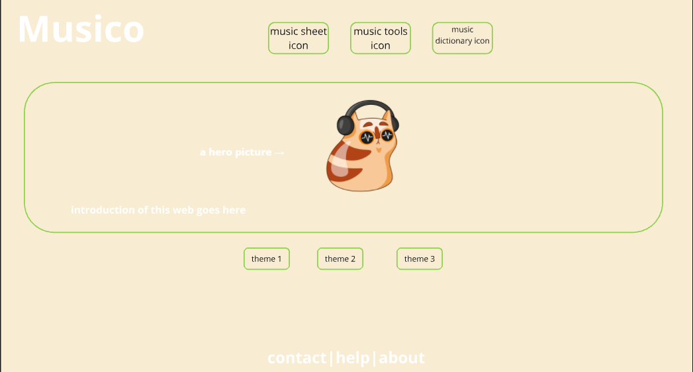

# Set up instructions
start front-end:
  - cd client/musico
  - npm run dev
start back-end: 
  - cd server/
  - nodemon index.js

have .env file (Yes)

# Project Title
Musico

## Overview

Musico is an interactive platform designed for musicians to access, annotate, and learn music more effectively.

### Problem

Musicians face significant challenges in managing and annotating their sheet music in a digital format. Current tools often fall short in seamlessly integrating comprehensive music theory knowledge directly with practical functionalities for sheet music management. This gap hinders efficient access and utilization of music resources, complicating the process for users to apply theoretical concepts directly onto their digital sheets. There is a clear need for a solution that not only allows for easy management and annotation of sheet music but also incorporates an in-depth understanding of music theory to enhance the educational and practical value of these digital tools.

### User Profile

- Musicians of all skill levels
- Music teachers and students
- Composers and arrangers

### Features

- Music Reader: Users can upload and store sheet music. Features include marking the sheet music with musical notation or using a highlighter, eraser, and undo functions. The reader also supports automatic scrolling and a metronome that can be played at various speeds.
- Music Tools:
    - Tuner: Plays the open string sound of a violin or guitar for tuning.
    - Metronome: Allows input of a beat that is played at a set frequency.
- Music Dictionary: Gets and displays information about chords and other musical terms, supports search and fuzzy search functions.

## Implementation

### Tech Stack

- React
- TypeScript
- MySQL
- Express
- Client libraries: 
    - react
    - react-router
    - axios
    - pdfjs-dist
    - fabric.js
- Server libraries:
    - knex
    - express

### APIs

- Custom APIs for managing user data, sheet music files, and annotations.
- Music theory API integration to fetch real-time data on music terms and chords.

### Sitemap

- Home Page
- Sheet Music Library
    -edit music scores
    -With auto-scroll function and built-in metronome
- Music Toolset
    -metronome
    -tuner(fake tuner, just can play sounds, cannot take inputs.)
- Music Dictionary

### Mockups

#### Home Page

#### Score library Page

#### Score edit Page

#### Tools metronome Page

#### Tools tuner Page

#### Music dictionary Page

#### Music dictionary item Page

### Data

### Endpoints

**GET /sheets**
- Fetch all sheet music.
response:
{
  "sheets": [
    {
      "id": 1,
      "title": "Beethoven Symphony No.9",
      "composer": "Ludwig van Beethoven",
      "uploadedAt": "2024-01-01"
    },
    {
      "id": 2,
      "title": "Chopin Nocturne Op.9 No.2",
      "composer": "Frédéric Chopin",
      "uploadedAt": "2024-01-02"
    }
  ]
}

**POST /sheets**
- Upload new sheet music.

parameters：
- title (string): Title of the sheet music.
- composer (string): Composer's name.
- file (file): The sheet music file.

response:
{
  "success": true,
  "id": 3,
  "message": "Sheet music uploaded successfully."
}

**PUT /sheets/{id}**
- Update existing sheet music.

parameters：
- id (path variable): ID of the sheet music to update.
- title (string, optional): New title of the sheet music.
- composer (string, optional): New composer's name.
- file (file, optional): New sheet music file.
- title (string): Title of the sheet music.
- composer (string): Composer's name.
- file (file): The sheet music file.
response:
{
  "success": true,
  "id": 3,
  "message": "Sheet music uploaded successfully."
}
**DELETE /sheets/{id}**
- Remove sheet music.

parameters：
- id (path variable): ID of the sheet music to delete.
response:
{
  "success": true,
  "id": 1,
  "message": "Sheet music deleted successfully."
}

**GET /dictionary**
- term (string, optional): A search term to filter music theory terms.

parameters：
- id (path variable): ID of the sheet music to delete.
response:
{
  "terms": [
    {
      "term": "Chord",
      "definition": "A combination of notes sounded together."
    },
    {
      "term": "Scale",
      "definition": "A series of notes ordered by ascending or descending pitch."
    }
  ]
}

## Roadmap

- Create Client
    -Set up a React project with Next.js, including routing and boilerplate pages.

- Create Server
    - Initialize an Express project with basic routing. 

- Create Database Migrations
    - Define database schema and create migrations for PostgreSQL to set up tables for sheet music, annotations, and music dictionary terms.

- Gather Sample Music Data
    -Collect 15 sample sheet music files in two different music genres or styles.

- Create Seed Data
    -Develop seed scripts to populate the database with initial music data and dictionary entries.

- Deploy Client and Server
    -Set up deployment processes using a platform like Vercel for the client and Heroku for the server to reflect all commits in production.

- Feature: List Sheet Music
    - Implement a page to list all sheet music. Include a search and filter functionality based on music genre or composer.
    - Store user-selected filters or searches in sessionStorage.
    - Develop a GET /sheets endpoint on the server to fetch sheet music based on specified criteria.

- Feature: View Sheet Music
    - Create a detailed view page for individual sheet music files.
    - Allow users to view and interact with music sheets using Fabric.js for annotations.
    - Set up a GET /sheets/{id} endpoint to fetch specific sheet music details.

- Feature: Annotate Sheet Music
    - Add functionalities to annotate sheet music with symbols, highlighters, and text notes.
    - Implement saving and retrieving annotation data.
    - Develop POST and PUT endpoints for creating and updating annotations.

- Feature: Music Dictionary
    - Develop a feature for users to search and view music theory terms from the music dictionary.
    - Use Teoria library to provide additional music theory resources and tools.
    - Implement a GET /dictionary endpoint to serve dictionary data based on search queries.

- Feature: Tuner and Metronome Tools
    - Implement interactive music tools such as a tuner and a metronome using the Web Audio API.
    - Allow users to access these tools from within the sheet music viewer or as standalone features.

- Bug Fixes and Testing
    -Conduct comprehensive testing to identify and fix any issues. Include unit tests, integration tests, and user acceptance testing.

- DEMO DAY

## Nice-to-haves
- User register and log in.
    - using JWT auth
- Advanced audio analysis tools.
    - implement the real tuning tool
- Community features for shared annotations.
    -Using open AI to recommend learning resources.
    -Allow users to communicate
- Edit music sheets
  -able to highlight and add annotations to sheets